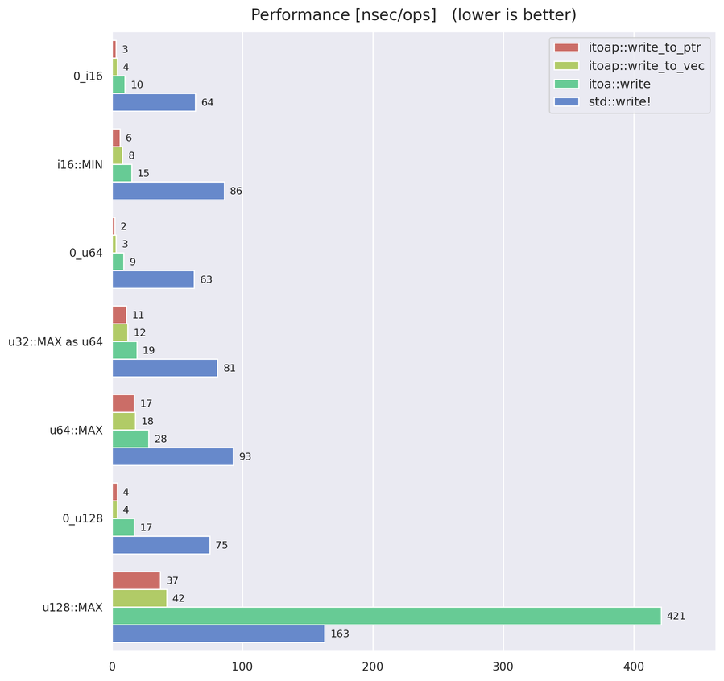

# Welcome to itoap 👋

This crate provides even faster functions for printing integers with default format
than [itoa](https://crates.io/crates/itoa) crate.

## Comparison with `itoa` crate

If you want to write integers in decimal format to `String`, `Vec` or any other
contiguous buffer, then this crate is the best choice.

If you want to write integers to a `std::io::Write` or `std::fmt::Write`, 
[itoa](https://github.com/dtolnay/itoa) crate and `itoap` crate shows almost same
performance for some types, but `itoap` is generally faster.

The implementation is based on the `sse2` algorithm from
[itoa-benchmark](https://github.com/miloyip/itoa-benchmark) repository.
While `itoa` crate writes integers from **last** digits, this algorithm writes
from **first** digits. It allows integers to be written directly to the buffer.
That's why `itoap` is faster than `itoa`.

## Benchmark result

Benchmark program was executed under the following environment:

|Hardware/Software|Version|
|--|--|
|CPU model name|Intel(R) Core(TM) i5-8265U CPU @ 1.60GHz|
|CPU micro architecture|Sky Lake|
|Standard libc implementation|glibc 2.31.0|
|rustc|1.51.0-nightly (368275062 2021-02-02)|

:warning: performance of `itoa` crate highly depends on the CPU architecture and libc implementation.

## Author

👤 **Ryohei Machida**

* Github: [@Kogia-sima](https://github.com/Kogia-sima)

## 🤝 Contributing

Contributions, issues and feature requests are welcome!

Feel free to check [issues page](https://github.com/Kogia-sima/itoap/issues). 

## Show your support

Give a ⭐️ if this project helped you!

## 📝 License

Copyright © 2014-2016 Milo Yip, 2020 [Ryohei Machida](https://github.com/Kogia-sima).

This project is [MIT](https://github.com/Kogia-sima/itoap/blob/master/LICENSE) licensed.

***
_This README was generated with ❤️ by [readme-md-generator](https://github.com/kefranabg/readme-md-generator)_
